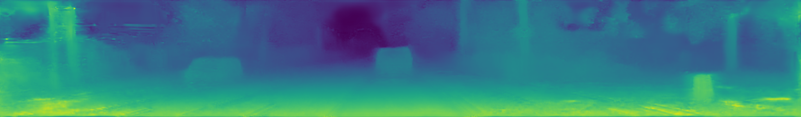
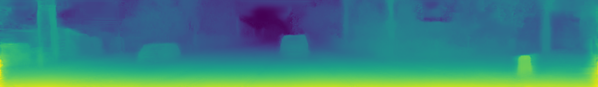

# panoramic-depth-estimation-pytorch

This repository is pytorch implementation of [Eliminating blind spot](https://github.com/gdlg/panoramic-depth-estimation).
Also, just for reference, training code of [omnidepth](https://github.com/meder411/OmniDepth-PyTorch) is implemented, which uses [ThreeD60 dataset](https://github.com/VCL3D/3D60).
Please, check the codes below first.
* [Eliminating blind spot](https://github.com/gdlg/panoramic-depth-estimation)
* [omnidepth](https://github.com/meder411/OmniDepth-PyTorch)
* [ThreeD60 dataset](https://github.com/VCL3D/3D60)

For people who only interested in rectilinear image depth, use [Monodepth-pytorch](https://github.com/meder411/OmniDepth-PyTorch) instead.

## What is implemented? 
* mixed-warp pre-trained model of [Eliminating blind spot](https://github.com/gdlg/panoramic-depth-estimation) is conveted to pytorch version.
* Training using rectilinear image is implemented.
* Bilinear sampling using equirectilinear image is implemented.

## What is not implemented or validated?
* Training using ThreeD60 dataset is not validated.
* Training using equirectangular image is not validated.

## Validation of converted pytorch code.

### 1) Pytorch network architecture and converted pre-trained model 
For vgg network structure and mixed-warp pre-trained model, MSE of 2.6 * 10^(-8) is calculated  between tensorflow and pytorch version.
 
 
### 2) pytorch training code 
* Environment

The weights of pytorch model are initialized using mixed-warp pre-trained model and trained for 10 epochs using rectilinear KITTI dataset.
Default hyper parameters in main.py, are uses as training environment. 
* Results 

pytorch version gives almost same results with tensorflow pre-trained model. For equirectangular testset, they also give almost similar results.

* Input cropped from KITTI dataset

* Tensorflow mixed-warp output

* pytorch output trained for 10 epochs

Quantitative comparison was not conducted.

## Getting started
### 1) Prepare dataset
For KITTI dataset, refer to [panoramic-depth-estimation](https://github.com/gdlg/panoramic-depth-estimation).
For ThreeD60 dataset, refer to [ThreeD60 dataset](https://github.com/VCL3D/3D60).

### 2) Install prerequisites
This repo is tested under 

* python3.5
* cuda9.0
* pytorch 1.0

### 3) Make pytorch pre-trained model

Although, there is some conversion tool between frameworks, such as [MMDNN](https://github.com/microsoft/MMdnn), this code was not converted well. 
Threrefore, to reproduce same results with tensorflow version, the weights of tensorflow pre-trained model are extracted as raw data. 
Then, raw data of pre-trained model in 'numpy_weight' is loaded to pytorch model.
To convert raw data to pytorch checkpoint, do

~~~bash
python3 main.py --mode make  --model_name [YOuR_CHECKPOINT_PATH] --KITTI 
~~~
Pre-trained model will be saved as 'YOUR_CHECKPOINT_PATH/models/generator.pkl' .
If you want to load only some part of the pre-trained model. check 'load_weights()' in layer_model.py.
### 4) Inference

~~~bash
python3 main.py --rectilinear_mode --mode sample --val_path [YOUR_EVAL_DATA_PATH] --checkpoint_path [YOUR_CHECKPOINT_MODEL_PATH] --model_name [YOUR_MODEL_PATH] --KITTI
~~~
Results will be saved to 'YOUR_MODEL_PATH/evaluate' folder.
### 5) Training

~~~bash
python3 main.py --mode train --rectilinear_mode  --KITTI --model_name [YOUR_MODEL_PATH] --val_path [YOUR_EVAL_DATA_PATH] --lr 0.0001  --checkpoint_path [YOUR_CHECKPOINT_MODEL_PATH] --batch_size 8 --kitti_train_path [KITTI_DATA_PATH]
~~~

For equirectangular dataset, do
~~~bash
python3 main.py --mode train  --KITTI --model_name [YOUR_MODEL_PATH] --val_path [YOUR_EVAL_DATA_PATH] --lr 0.0001  --checkpoint_path [YOUR_CHECKPOINT_MODEL_PATH] --batch_size 8
~~~
But training with equirectangular image is not validated.

## Citation & License
Refer to 
* [Eliminating blind spot](https://github.com/gdlg/panoramic-depth-estimation)
* [omnidepth](https://github.com/meder411/OmniDepth-PyTorch)
* [ThreeD60 dataset](https://github.com/VCL3D/3D60)
